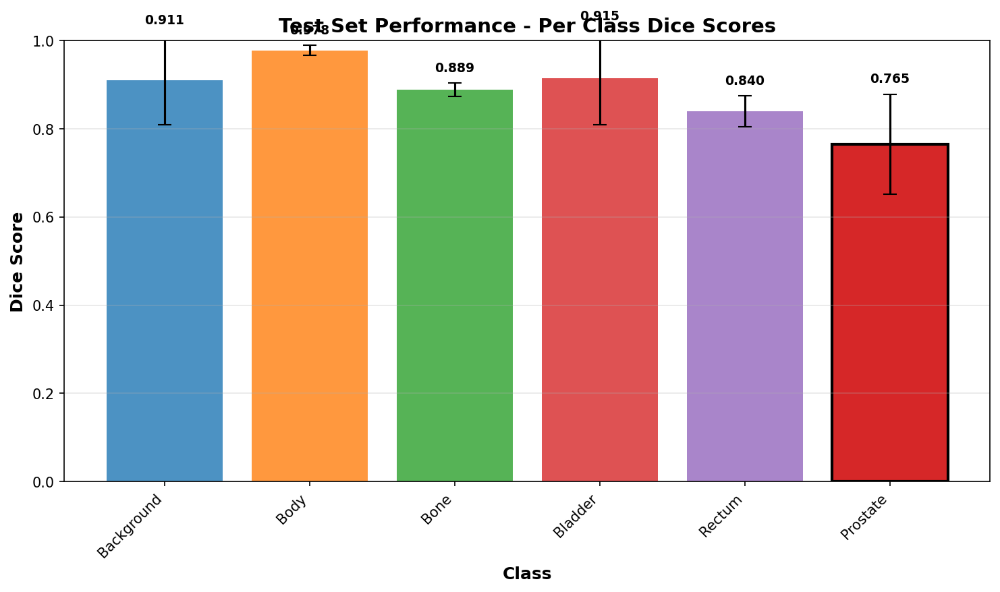
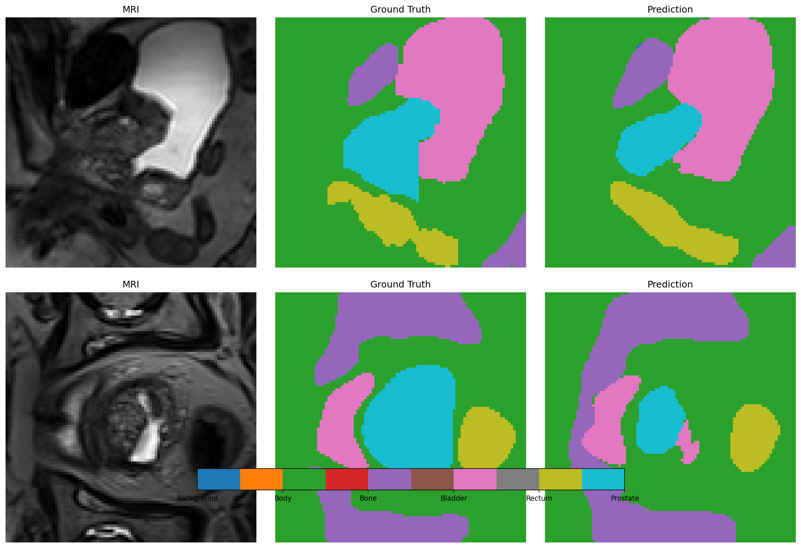
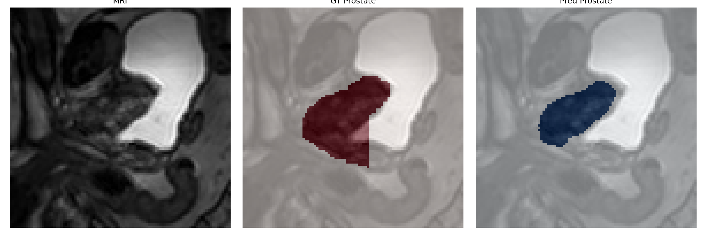

# Prostate Segmentation with Improved 3D U-Net

**COMP3710 - Pattern Analysis 2025**

A deep learning framework for **3D prostate segmentation** from MRI scans using an **Improved 3D U-Net** with **deep supervision** and **128³ voxel patches**, trained and evaluated with the **MONAI** medical imaging framework.

---

## Table of Contents

- [Overview](#overview)
- [Dataset](#dataset)
- [Model Architecture](#model-architecture)
- [Implementation Details](#implementation-details)
- [Results](#results)
- [MONAI Framework](#monai-framework)
- [Usage](#usage)
- [Project Structure](#project-structure)
- [Discussion](#discussion)
- [References](#references)

---

## Overview

This project addresses automatic **3D segmentation of the prostate gland** from MRI scans — a crucial step in diagnosis and treatment planning for prostate cancer, radiotherapy, and surgical guidance.

**Segmentation Classes:**

0. Background  
1. Body  
2. Bone  
3. Bladder  
4. Rectum  
5. **Prostate (target organ)**

**Problem Type:** Multi-class 3D semantic segmentation  
**Task Difficulty:** Hard (due to small organ size and class imbalance)

---

## Dataset

**Source:** *HipMRI Study (Longitudinal MRI dataset)*  
**Scans:** 211 MRI volumes from 38 patients  
**Splitting:** Done at the **patient level** to prevent leakage across timepoints.

```

Train: 152 (26 patients)
Val:   24  (5 patients)
Test:  35  (7 patients)

```

### Preprocessing
- **Normalization:** Z-score per volume (μ=0, σ=1)  
- **Patch size:** 128 × 128 × 128 voxels (optimal balance of context and memory)  
- **Augmentation (via MONAI):**
  - Random flips and rotations  
  - Intensity scaling/shifting (±10%)  
  - Gaussian noise and smoothing  

---

## Model Architecture

### Improved 3D U-Net

Based on the 3D U-Net [2] with refinements inspired by nnU-Net [3]:

**Key Features**
- Instance Normalization (better for small batches)  
- Leaky ReLU activation (α=0.01)  
- Residual skip connections  
- Deep supervision across decoder layers  

**Model Specs**
- Parameters: ~22.6M  
- Input shape: (1, 128³)  
- Output shape: (6, 128³)  
- Encoder depth: 4 levels, 32→512 features  

### Loss Function
**Dice + Cross-Entropy (DiceCE) Loss**
```

Total Loss = 1.0·L_main + 0.5·L_aux1 + 0.25·L_aux2

````

---

## Implementation Details

**Training Configuration**
```python
Optimizer: AdamW (lr=1e-4, weight_decay=1e-5)
Scheduler: ReduceLROnPlateau (factor=0.5, patience=5)
Batch size: 1
Epochs: 10
Precision: FP16 (automatic mixed precision)
Framework: PyTorch + MONAI
````

Training converged smoothly, achieving best validation Dice at epoch 9 (0.8903). No overfitting was observed.

**Hardware Requirements**

* RAM: ≥8 GB
* Storage: ~5 GB (dataset + checkpoints)

---

## Results

### Test Set (35 scans / 7 patients)

| Class        |  Mean Dice | Std Dev |
| :----------- | :--------: | :-----: |
| Background   |   0.9107   |  ±0.10  |
| Body         |   0.9781   |  ±0.01  |
| Bone         |   0.8891   |  ±0.02  |
| Bladder      |   0.9154   |  ±0.11  |
| Rectum       |   0.8396   |  ±0.04  |
| **Prostate** | **0.7653** |  ±0.11  |

**Mean Dice (non-background): 0.8775**

* **Validation Dice:** 0.8903
* **Test Dice:** 0.8775
  → Only a 1.4% difference in validation vs test, showing excellent generalization.

---

### Visual Results

**Overall segmentation quality across structures**


**Example prediction showing all anatomical structures**

*Figure: Multi-class segmentation result showing MRI slice (left), ground truth (center), and model prediction (right). All six anatomical structures are accurately segmented.*


**Colour Legend for Anatomical Structures:**
| Colour | Class | Structure |
|-------|-------|-----------|
| Black/Dark | 0 | Background |
| Cyan/Light Blue | 1 | Body (soft tissue) |
| Yellow/Gold | 2 | Bone (pelvis, femur) |
| Blue | 3 | Bladder |
| Green | 4 | Rectum |
| Red/Pink | 5 | Prostate (target organ) |


**Prostate-focused overlay (target organ)**

*Figure: Prostate segmentation overlay where red indicates ground truth, blue shows model prediction, and purple represents correct overlap. High overlap demonstrates accurate prostate boundary delineation.*

**Colour Legend for Prostate Overlay:**
| Colour | Meaning |
|-------|---------|
| Red | Ground truth (expert annotation) |
| Blue | Model prediction |
| Purple | Correct overlap (true positives) |
| Red only | False negatives (missed tissue) |
| Blue only | False positives (over-segmentation) |

**Note:** Additional prediction samples (prediction_sample_2.png, prediction_sample_3.png) and prostate overlays (prostate_sample_2.png, prostate_sample_3.png) are available in `recognition/results/` demonstrating consistent performance across diverse anatomical variations.


---

## MONAI Framework

Although the **core U-Net architecture** was custom-built, this project also relied on **MONAI (Medical Open Network for AI)** for the surrounding deep learning pipeline.

### Why MONAI Was Chosen

1. **Purpose-built for medical imaging:** MONAI provides domain-specific preprocessing, transforms, and losses optimized for volumetric MRI data.
2. **High-quality augmentation library:** Built-in 3D augmentations (rotations, flips, Gaussian noise) increase model robustness without custom code.
3. **Optimized losses:** `DiceCELoss` in MONAI seamlessly combines region overlap and classification loss—ideal for imbalanced medical datasets.
4. **Reproducibility and stability:** MONAI ensures deterministic behavior and consistent evaluation across training runs.
5. **Ease of integration:** It integrates cleanly with PyTorch while maintaining flexibility to use custom architectures.

**Key MONAI components used:**

* `monai.transforms` – for augmentations
* `monai.losses.DiceCELoss` – hybrid Dice and CE loss
* `monai.metrics.DiceMetric` – multi-class Dice computation
* `monai.data` utilities – efficient loading of 3D NIfTI volumes

This combination made MONAI the best choice for a support tool for building a reliable, reproducible, and high-quality medical segmentation pipeline.

---

## Usage

### Setup

```bash
git clone https://github.com/yourusername/patternanalysis-2025.git
cd patternanalysis-2025/recognition
python -m venv pattern_env
source pattern_env/bin/activate     # or pattern_env\Scripts\activate
pip install -r requirements.txt
```

### Run

**Training**

```bash
python train.py
```

**Prediction**

```bash
python predict.py
```

**Evaluation (optional)**

```bash
python test_data_eval.py
```

Outputs are stored in `recognition/results/` with performance charts, predictions, and prostate overlays.

---

## Project Structure
```
patternanalysis-2025/
├── recognition/
│   ├── config.py              # Configuration settings (patch size, hyperparameters, paths)
│   ├── dataset.py             # Data loading with patient-level splitting and augmentation
│   ├── modules.py             # Improved 3D U-Net architecture definition
│   ├── train.py               # Training script with deep supervision and mixed precision
│   ├── test_data_eval.py      # Optional test set evaluation with detailed metrics and visualization
│   ├── predict.py             # Prediction and visualization generation for sample cases
│   ├── checkpoints/           # Saved model weights and training checkpoints
│   ├── results/               # Training curves, test results, and prediction visualizations
│   └── logs/                  # TensorBoard logs for training monitoring
└── README.md                  # Project documentation
```

## Discussion

### Strengths

* Improved 3D U-Net achieved strong and stable segmentation for small organs like the prostate.
* Deep supervision with 128³ patches helped the model learn fine anatomical details.

### Limitations

* Slightly lower performance for very small or off-center prostates due to limited patch context.
* Sensitive to unusual intensity variations in MRI scans.

### Future Work

* Multi-scale inputs, attention mechanisms, and full-volume sliding-window inference could improve results.
* Post-processing with connected components or CR

---

## References

1. Ronneberger, O. et al. (2015). *U-Net: Convolutional Networks for Biomedical Image Segmentation.*
2. Çiçek, Ö. et al. (2016). *3D U-Net: Learning Dense Volumetric Segmentation from Sparse Annotation.*
3. Isensee, F. et al. (2021). *nnU-Net: A Self-Configuring Method for Biomedical Image Segmentation.*
4. MONAI Consortium (2020). *Medical Open Network for AI.*
5. Litjens, G. et al. (2014). *The PROMISE12 Challenge.*

---

## Author

**Kavya Sikka**
Student ID: s4913017
**Course:** COMP3710 – Pattern Analysis 2025
**Email:** [s4913017@student.uq.edu.au](mailto:s4913017@student.uq.edu.au)

---

## License

This project is part of a university coursework submission for educational purposes.
Dataset © HipMRI Study (used under academic license).

**Last Updated:** October 29, 2025
**Version:** 2.0 (128³ Implementation)


